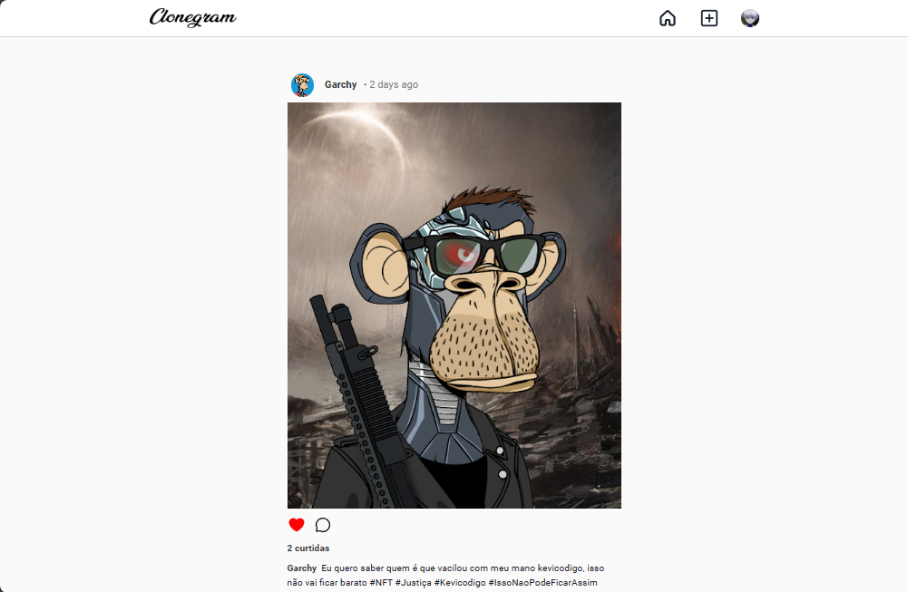
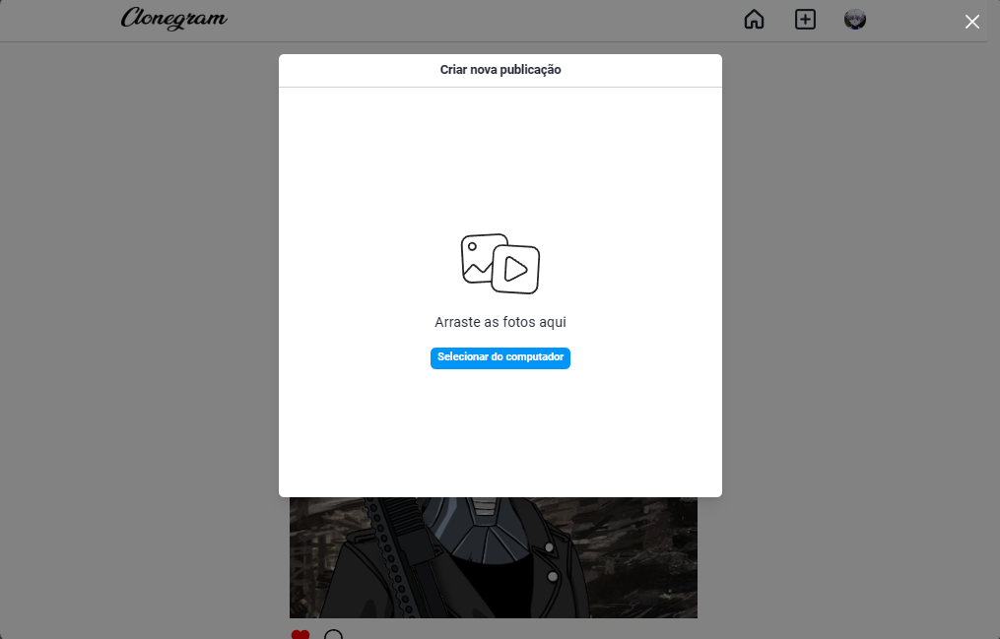
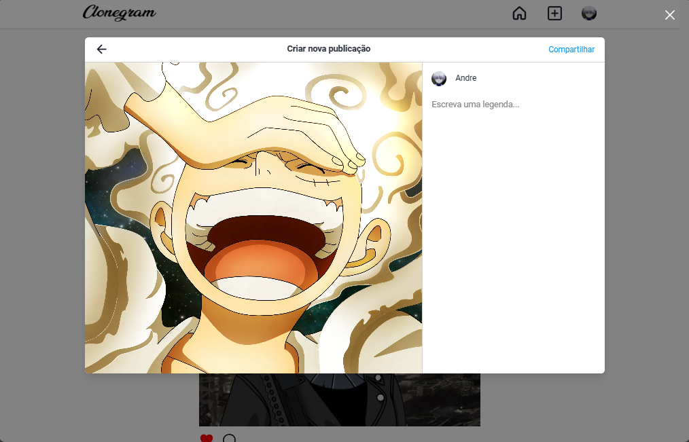
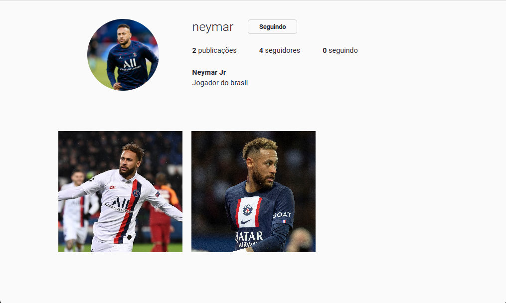

# Clonegram - An instagram clone

## Preview
### Timeline page, fed with posts from people you follow


### Create a post



### Like and comment a post


### See other people's profiles


## Prerequisite
- [Yarn](https://yarnpkg.com/)
- [NodeJS](https://nodejs.org/)
- [MongoDB](https://www.mongodb.com/)
- [AWS S3](https://aws.amazon.com/s3/)

## Technologies

### Frontend
- React
- Relay
- ChakraUI
- Vite

### Backend
- NodeJS
- KoaJS
- GraphQL
- MongoDB
- AWS S3

## How to run

1. Clone the project
```
git clone https://github.com/CarlosAndre02/clonegram.git
```

2. Go to `packages/web` and `packages/server` and remove the `.example` suffix from the `.env` files. Then, fill in the environment variables in both packages.

3. Install the dependencies
```
yarn install
```

4. Run the server
```
yarn dev:server
```

5. Now, run the wep app
```
yarn dev:web
```
